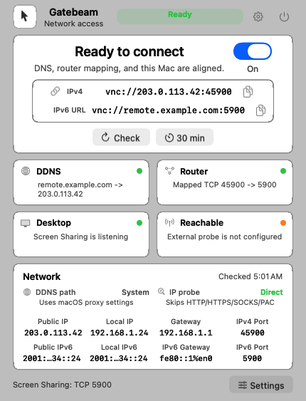
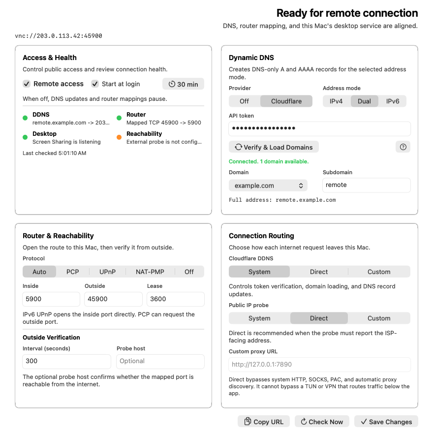

# Gatebeam

Gatebeam is a native macOS menu bar app for keeping a remote-desktop entry point current without handing DNS and router mapping work to a collection of unrelated tools. It manages Cloudflare DDNS and local-network port exposure for macOS Screen Sharing / Remote Management (TCP `5900`).

> **Development baseline:** this repository is an open-source development baseline for Gatebeam. It is released under the [MIT License](LICENSE), is not Apple-notarized, and should be reviewed and built locally before it is used to expose a remote-desktop service.

> **Security first:** publishing VNC to the public internet is inherently risky. This app helps manage the network path; it does not make an internet-facing VNC service safe by itself. Read [Network and VNC safety](#network-and-vnc-safety) before enabling remote access.





## What It Does

- Updates Cloudflare DNS-only `A` and `AAAA` records, creating a missing record when necessary.
- Supports IPv4-only, IPv6-only, and dual-stack DDNS operation.
- Detects a physical LAN interface and deprioritizes tunnel interfaces when selecting local addresses.
- Uses PCP where available, NAT-PMP for IPv4, and UPnP IGD for IPv4 port mappings.
- Supports UPnP `WANIPv6FirewallControl` pinholes for IPv6-capable routers.
- Checks whether macOS Screen Sharing / Remote Management is listening on TCP `5900`.
- Renews mappings and can remove them when remote access is disabled.
- Stores Cloudflare credentials in the macOS Keychain, not in the app configuration file.

## Quick Start

1. Enable **Screen Sharing** or **Remote Management** in macOS System Settings.
2. Open Gatebeam from the menu bar and open **Settings**.
3. Select **Cloudflare**, enter an API token, then choose a zone and hostname.
4. Choose `IPv4`, `Dual`, or `IPv6` address mode.
5. Confirm the inside port (`5900`) and choose a high external IPv4 port.
6. Review the network-path status and explicitly enable remote access.

The app creates DNS records as **DNS only**. Cloudflare's standard orange-cloud proxy is for HTTP(S) and will not proxy a VNC TCP connection.

## Proxy And Network Path Policy

Different operations should not all inherit the same proxy behavior. In particular, a public-IP lookup routed through a local VPN or HTTP proxy can publish the proxy exit address instead of the address reachable through the home router.

The app presents a network-path setting for Cloudflare/DDNS traffic and keeps local-router protocols direct. The intended defaults are deliberately conservative:

| Operation | Default behavior | Configurable | Why |
| --- | --- | --- | --- |
| Cloudflare token verification and DNS updates | Follow macOS proxy settings | Yes: system proxy, direct, or custom HTTP/HTTPS/SOCKS proxy | Some managed networks require a proxy to reach Cloudflare. |
| Public IPv4/IPv6 address probes | Direct, bypass HTTP/HTTPS/SOCKS/PAC and auto-discovery | Yes: direct, system proxy, or custom proxy | Direct is recommended; a proxy can return its own exit address. |
| Router WAN IPv4 query | Direct local-network protocol | No | NAT-PMP, PCP, and UPnP target the local gateway, not the internet. |
| PCP, NAT-PMP, UPnP, and IPv6 pinholes | Direct local-network protocol | No | These are LAN control protocols and must never traverse an HTTP proxy. |
| Local Screen Sharing check | Loopback/LAN only | No | It verifies the Mac's own TCP listener. |
| External reachability verification | Direct by default | Yes where a future verifier needs it | A proxy can hide whether the direct VNC path works. |

The router-reported WAN IPv4 address is preferred over a web probe when the router provides one. The app detects private/CGNAT-like router WAN addresses and reports that an IPv4 mapping may not be reachable from the wider internet. For IPv6, it selects a global address from a physical interface rather than a link-local, ULA, or tunnel address when possible.

Even direct URLSession traffic cannot bypass a route-level VPN/TUN, firewall, or transparent network interception. During diagnosis, temporarily disable those tools or compare the displayed route and address with your router's own status page.

## Cloudflare Permissions

Create a scoped API token under **Cloudflare Dashboard > My Profile > API Tokens > Create Token**. The **Edit zone DNS** template is a good starting point. Grant:

- `Zone > DNS > Edit`
- `Zone > Zone > Read`

Restrict **Zone Resources** to the one zone used by this Mac. Use access to all zones only when you want the app to list every eligible zone. Do not use the Global API Key. Avoid Client IP filtering for a DDNS token because the connection's source address can change.

Useful Cloudflare references:

- [Create API tokens](https://developers.cloudflare.com/fundamentals/api/get-started/create-token/)
- [API token permissions](https://developers.cloudflare.com/fundamentals/api/reference/permissions/)
- [DNS Records API](https://developers.cloudflare.com/api/resources/dns/subresources/records/)

## IPv6 Notes

IPv6 normally uses firewall pinholes rather than address translation. PCP may grant the requested external port; `WANIPv6FirewallControl` exposes the Mac's local service port directly. As a result, IPv4 and IPv6 can legitimately have different connection ports. The app should show separate family-specific VNC URLs in that case.

Some networks do not offer usable global IPv6, do not expose PCP, or prohibit inbound IPv6 in the ISP router. Dual-stack status is therefore reported per address family rather than as a single all-or-nothing result.

Protocol references: [PCP RFC 6887](https://datatracker.ietf.org/doc/html/rfc6887) and [UPnP WANIPv6FirewallControl](https://upnp.org/specs/gw/UPnP-gw-WANIPv6FirewallControl-v1-Service.pdf).

## Build And Test

Requirements: macOS with Xcode Command Line Tools or Xcode installed.

```sh
./scripts/test_backend.sh
./scripts/test_proxy_policy.sh
./scripts/build_app.sh
```

The built app is written to `dist/Gatebeam.app`.

For a distributable artifact:

```sh
./scripts/package_pkg.sh
./scripts/package_dmg.sh
```

The PKG supports installation and upgrade. The DMG is a drag-to-Applications artifact when the local macOS environment can create disk images.

## Installation And Trust

This project may be built with a stable ad hoc signature for local development. It is **not Developer ID signed or Apple notarized** unless a release explicitly says otherwise. macOS may therefore show a security warning on first launch. Build from source when you need a fully auditable local artifact.

Do not grant Keychain access to a process you do not recognize. A legitimate app should request access only when saving or retrieving its own Cloudflare token, never repeatedly while merely displaying diagnostics or screenshots.

Use the macOS system proxy when it requires authentication. Avoid embedding a proxy username or password in a custom proxy URL, because configuration files are not a replacement for Keychain-backed secret storage.

## Network And VNC Safety

- Keep remote access disabled unless you are actively using it.
- Use a strong macOS account password and keep macOS patched.
- Prefer a random high IPv4 external port over public TCP `5900`.
- Set a temporary access window and close mappings afterward.
- Treat an IPv6 pinhole to TCP `5900` as public exposure of the native service.
- Test from a network outside your home LAN; many routers do not support hairpin NAT.
- Prefer a private overlay network, SSH tunnel, or managed remote-access solution for long-lived access.

## Contributing

Please read [CONTRIBUTING.md](CONTRIBUTING.md) before opening an issue or pull request. Security-sensitive bugs should follow [SECURITY.md](SECURITY.md), not public issue reporting.

## License

Released under the [MIT License](LICENSE).
